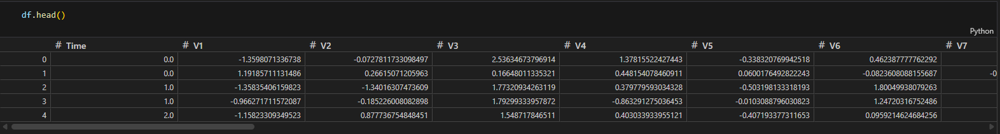
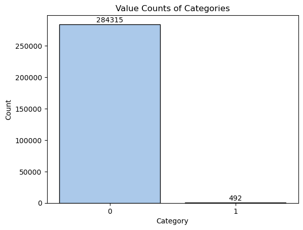
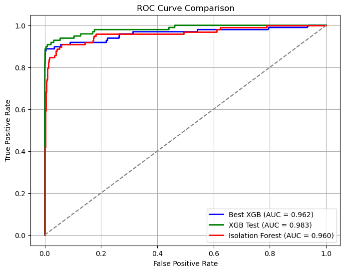
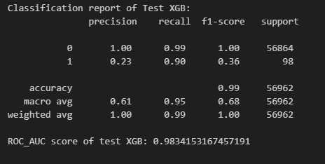
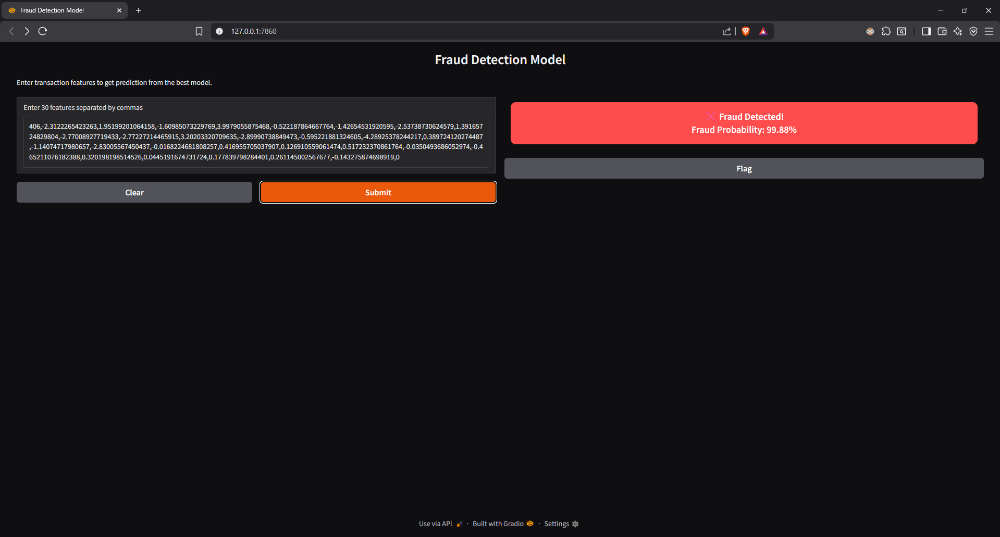
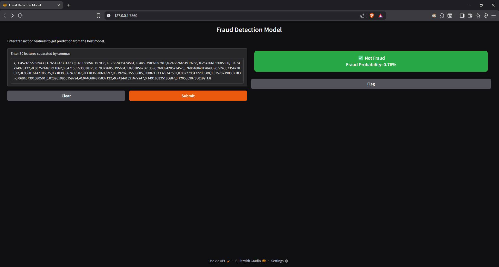
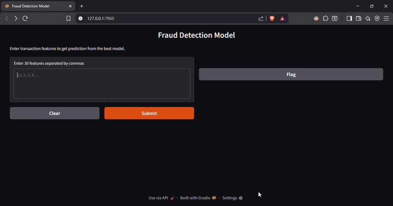

# 💳 Credit Card Fraud Detection

- This project aims to detect fraudulent credit card transactions using machine learning techniques.  
- The dataset used is the **Credit Card Fraud Detection Dataset** available on [Kaggle](https://www.kaggle.com/mlg-ulb/creditcardfraud).  
- The goal is to build a highly sensitive model that can accurately detect fraud cases while minimizing false negatives.

---

## 🧠 Project Overview

- **Objective:** Identify fraudulent credit card transactions.
- **Dataset:** `creditcard.csv` (from Kaggle)
- **Tech Stack:**
  - **Languages & Tools:** Python, Jupyter Notebook, Gradio
  - **Libraries:** pandas, numpy, scikit-learn, xgboost, seaborn, matplotlib, imbalanced-learn
- **Machine Learning Approach:**
  - Exploratory Data Analysis (EDA)
  - Data preprocessing and handling of imbalanced data using **SMOTE**
  - Model training and evaluation with multiple algorithms
  - **Best model selected based on ROC-AUC and Recall**
  - Model deployment using **Gradio**

---

## 📁 Project Structure

```
CreditCard-Fraud-Detection/
│
├── fraud_detection_analysis.ipynb # Jupyter notebook for data analysis and model building
├── fraud_detection_model.py # Deployed model code using Gradio
├── best_model.pkl # Saved best performing model
├── requirements.txt # List of dependencies
└── README.md # Project documentation

```

---

## 🔍 Data Exploration

- Dataset contains **283,726 transactions** and **31 columns** (`Time`, `V1`–`V28`, `Amount`, and `Class`).
- Highly **imbalanced dataset**:
  - `Class = 0` → Non-fraudulent (99.83%)
  - `Class = 1` → Fraudulent (0.17%)

### 🧾 Sample Data Preview



### 🔢 Class Distribution


---

## ⚙️ Data Preprocessing

- Standardized features using `StandardScaler`
- Split dataset into training and testing sets (80:20)
- Used **SMOTE (Synthetic Minority Oversampling Technique)** to balance classes in the training data.

---

## 🤖 Model Building and Evaluation

Tested multiple models to find the best performing one based on **ROC-AUC** and **Recall** scores.

### Models Evaluated:
1. **XGBoost (with SMOTE)**
2. **XGBoost (with scale_pos_weight)**
3. **Isolation Forest**

---

### 🔹 XGBoost (with scale_pos_weight) — *Best Model*

| Metric | Value |
|--------|--------|
| **ROC-AUC** | 0.98341 |
| **Recall (Fraud Class)** |  0.90 |
| **Precision (Fraud Class)** | 0.23 |
| **F1-Score (Fraud Class)** | 0.36 |


> ✅ **Reason for selection:** High **Recall** and **ROC-AUC** — critical for fraud detection problems.

📸 ROC Curve comparison


📸 Confusion Matrix of best model (`confusion_matrix.png`)



---

### 🔹 Isolation Forest (for anomaly detection)

| Metric | Value |
|--------|--------|
| **ROC-AUC** | 0.9603 |
| **Recall (Fraud Class)** | 0.89 |
| **Precision (Fraud Class)** | 0.03 |

While good at detecting anomalies, it performed poorly in precision compared to XGBoost.

---

## 💾 Model Saving

The **best performing XGBoost model** was saved as:
```python
joblib.dump(xgb_test, "best_model.pkl")
```


---

## 🌐 Model Deployment (Gradio App)

The model is deployed using **Gradio**, allowing users to input transaction features and get predictions in real time.

### 🧩 Deployment Script
File: `fraud_detection_model.py`

```python
iface = gr.Interface(
    fn=predict_model,
    inputs=gr.Textbox(label="Enter 30 features separated by commas"),
    outputs=gr.HTML(label="Result"),
    title="Fraud Detection Model",
    description="Enter transaction features to get prediction from the trained model."
)

iface.launch()
```

## 📈 Results Summary
| Model                      | ROC-AUC    | Recall   | Precision | F1-Score | Notes                      |
| -------------------------- | ---------- | -------- | --------- | -------- | -------------------------- |
| XGBoost (SMOTE)            | 0.961      | 0.89     | 0.17      | 0.28     | Good recall, balanced      |
| XGBoost (scale_pos_weight) | **0.9834** | **0.90** | 0.23      | **0.36** | ✅ **Best model**           |
| Isolation Forest           | 0.960      | 0.89     | 0.03      | 0.06     | High recall, low precision |


🧩 Requirements

Install dependencies:
```bash
pip install -r requirements.txt
```

Example requirements.txt:
```
pandas
numpy
matplotlib
seaborn
scikit-learn
xgboost
imbalanced-learn
joblib
gradio
```

## 🚀 How to Run the Project
1. Clone the Repository
```bash
git clone https://github.com/<your-username>/credit-card-fraud-detection.git
cd credit-card-fraud-detection
```
2. Run the Jupyter Notebook (for analysis)
```bash
jupyter notebook fraud_detection_analysis.ipynb
```
3. Run the Gradio App (for deployment)
```pytthon
python fraud_detection_model.py
```

Open the local URL generated by Gradio to interact with the model.

## Deployed model demo
    

Video_demo
  

## 📊 Future Improvements

- Integrate deep learning models (e.g., Autoencoders)
- Deploy on Streamlit Cloud or Hugging Face Spaces
- Add real-time transaction data monitoring